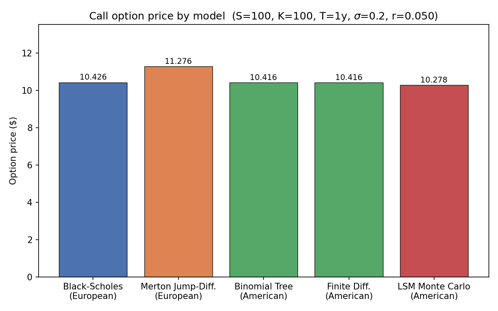
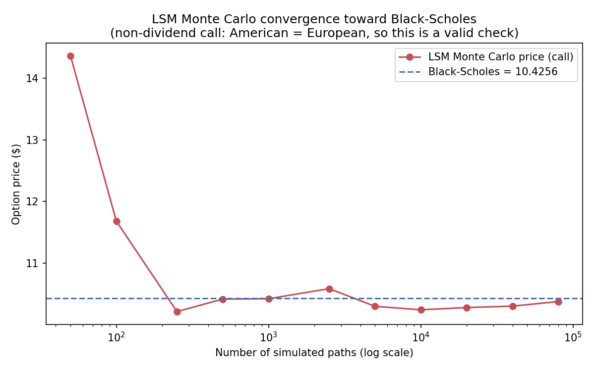
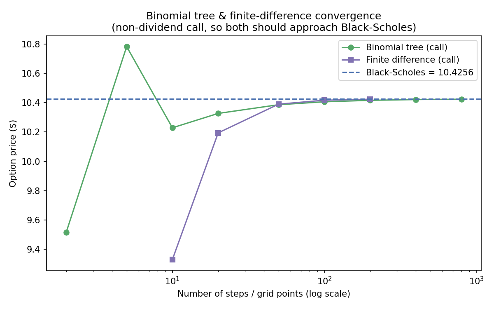
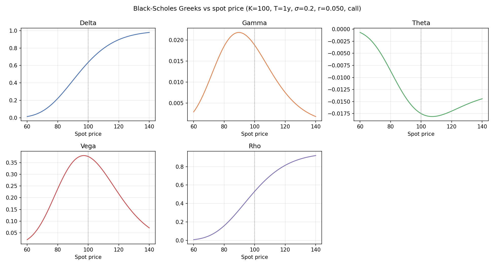
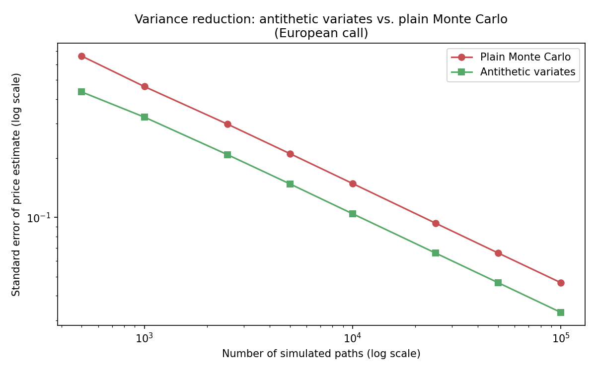
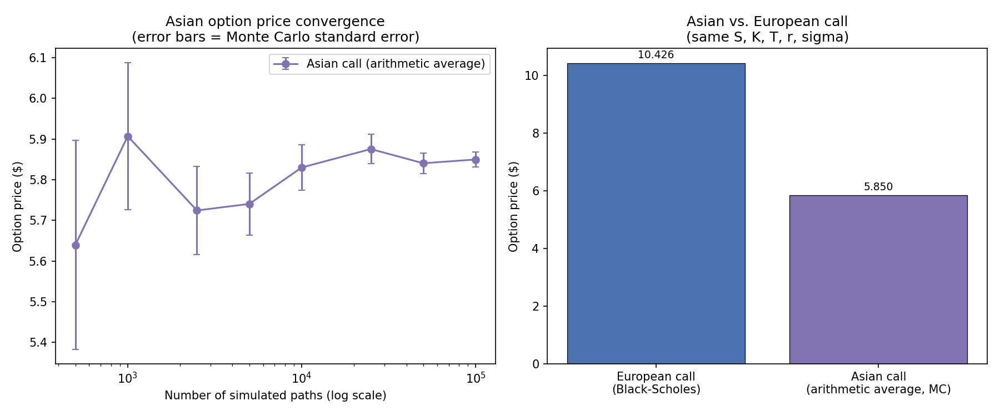

# Options Pricer — Black–Scholes, Merton Jump–Diffusion & American Option Models

A compact Python library for pricing **European, American, and path-dependent (Asian) options**
and computing their **Greeks**, comparing a closed-form analytical model against several
numerical methods (binomial tree, finite differences, Longstaff–Schwartz Monte Carlo, and a
variance-reduced Monte Carlo engine with antithetic variates). Built as a quantitative-finance
learning project.

All results and plots below were generated by actually running the code in this repository
(see [Reproducing these results](#reproducing-these-results) and
[`analysis/generate_results.py`](analysis/generate_results.py)).

---

## What it does

Given `(S, K, T, r, σ, option_type)`, the `pricer` package prices vanilla and path-dependent
options with seven methods and reports the standard risk sensitivities:

| Model | Option style | Type | File |
|---|---|---|---|
| Black–Scholes | European | closed-form | `pricer/pricing/european.py` |
| Merton Jump–Diffusion | European | closed-form (Poisson mixture of Black–Scholes) | `pricer/pricing/european.py` |
| Binomial (Cox–Ross–Rubinstein) tree | American | numerical (lattice) | `pricer/pricing/american.py` |
| Explicit finite differences | American | numerical (PDE grid) | `pricer/pricing/american.py` |
| Longstaff–Schwartz (LSM) | American | Monte Carlo | `pricer/pricing/american.py` |
| Monte Carlo (plain / antithetic variates) | European | Monte Carlo, variance-reduced | `pricer/pricing/exotic.py` |
| Arithmetic-average Asian | Path-dependent | Monte Carlo, variance-reduced | `pricer/pricing/exotic.py` |

Greeks (Delta, Gamma, Theta, Vega, Rho) are computed analytically from the Black–Scholes
formulas in `pricer/utils/greeks.py`. The risk-free rate defaults to a **live** 10-year US
Treasury yield pulled via `yfinance` (`pricer/utils/helpers.py`), falling back to a fixed 4%
if the request fails.

---

## Methodology

**Black–Scholes.** Under GBM dynamics `dS_t = r S_t dt + σ S_t dW_t`, the European call price is

```
C = S₀·Φ(d₁) − K·e^(−rT)·Φ(d₂),   d₁,₂ = [ln(S₀/K) + (r ± ½σ²)T] / (σ√T)
```

with the put obtained from put–call parity. Greeks are the corresponding partial derivatives
of this formula.

**Merton jump–diffusion.** Adds a compound-Poisson jump component (intensity `λ`, lognormal
jump size) to the GBM. The European price is a Poisson-weighted mixture of Black–Scholes prices
evaluated at jump-adjusted drift and volatility, truncated to the first 40 terms of the series
for numerical efficiency.

**Binomial tree (CRR).** A recombining lattice with up/down factors `u = e^(σ√Δt)`, `d = 1/u`
and risk-neutral probability `p`; backward induction applies `max(intrinsic, discounted
expectation)` at every node to capture early exercise.

**Finite differences.** Solves the Black–Scholes PDE explicitly on a `(price, time)` grid,
projecting the solution onto the exercise value at every time step (`V ≥ intrinsic`) to enforce
the American constraint. The time step is auto-shrunk if it violates the explicit-scheme
stability bound.

**Longstaff–Schwartz Monte Carlo (LSM).** Simulates GBM price paths, regresses the discounted
continuation value on a quadratic basis `[1, S, S²]` at in-the-money paths (backward from
maturity), and exercises whenever the immediate payoff beats the estimated continuation value.
The final price is the average of each path's discounted realized payoff.

**Antithetic-variates Monte Carlo.** Draws standard normal shocks `Z` for half the requested
paths, and pairs each with its mirror `-Z` for the other half. Since the discounted payoff of a
call is a monotonic function of `Z`, the payoffs from a `(Z, -Z)` pair are negatively correlated,
so averaging each pair before computing the sample variance reduces the estimator's standard
error versus the same number of independent draws — without needing more simulations.

**Arithmetic-average Asian option.** Simulates full GBM paths (not just the terminal price) and
prices a payoff based on the **arithmetic average price along the path**, `max(mean(S_t) - K, 0)`
for a call. This makes the payoff genuinely path-dependent, unlike every other pricer in this
repository, which only depends on the terminal (or early-exercise) price. Uses the same
antithetic-variates reduction as above.

---

## Results

### 1. Model comparison

Actual run (spot=100, strike=100, T=1y, σ=0.20, r pulled live from the 10Y Treasury yield at
run time ≈ 4.9%), call option:

```
Black-Scholes:              10.4235   # European call, closed-form
Merton Jump-Diffusion:      11.2752   # European call with jumps (adds ~0.85 for jump risk)
American Binomial (200 stp): 10.413   # American call
American Finite Diff.:      10.414    # American call
American LSM (20k paths):   10.276    # American call, Monte Carlo
```



The American-style methods land essentially on top of Black–Scholes, which is the expected
result: for a **non-dividend-paying call**, early exercise is never optimal, so the American
price must equal the European price. This is a useful internal consistency check on all three
American-style implementations. Merton's price is higher because it prices in the extra
variance contributed by jump risk.

### 2. Monte Carlo (LSM) convergence to the Black–Scholes price

Because early exercise has no value for a non-dividend call, the LSM engine (nominally an
American-option pricer) can be checked directly against the closed-form Black–Scholes price by
increasing the number of simulated paths:



| n_paths | LSM price | \|error\| vs Black–Scholes |
|---:|---:|---:|
| 50 | 14.359 | 3.935 |
| 100 | 11.677 | 1.253 |
| 250 | 10.210 | 0.213 |
| 500 | 10.413 | 0.011 |
| 1,000 | 10.526 | 0.102 |
| 2,500 | 10.581 | 0.157 |
| 5,000 | 10.292 | 0.131 |
| 10,000 | 10.240 | 0.184 |
| 20,000 | 10.277 | 0.147 |
| 40,000 | 10.302 | 0.121 |
| 80,000 | 10.373 | 0.050 |

The error shrinks in an O(1/√n) Monte Carlo way as the number of simulated paths grows.

### 3. Binomial tree & finite-difference convergence

Increasing the number of tree steps / grid points, both lattice/PDE methods converge to the
Black–Scholes benchmark, with the finite-difference scheme needing more steps at the low end to
stabilize (it uses an explicit scheme and auto-shrinks the time step for stability):



### 4. Greeks

Delta, Gamma, Theta, Vega and Rho computed analytically across a range of spot prices
(K=100, T=1y, σ=0.20):



Shapes match textbook behaviour: Delta is an S-curve from 0 to 1, Gamma and Vega peak at the
money, Theta is most negative near the money (time decay hurts most for ATM options), and Rho
increases monotonically with spot for a call.

### 5. Variance reduction: antithetic variates

Standard error of the Monte Carlo price estimate, plain vs. antithetic, same call option, at
matched total path counts:

| n_paths | Plain MC std. error | Antithetic std. error | Reduction |
|---:|---:|---:|---:|
| 500 | 0.6617 | 0.4349 | 34.3% |
| 1,000 | 0.4632 | 0.3238 | 30.1% |
| 5,000 | 0.2112 | 0.1482 | 29.8% |
| 10,000 | 0.1488 | 0.1044 | 29.8% |
| 100,000 | 0.0466 | 0.0329 | 29.4% |



Antithetic variates cut the standard error by a consistent **~30%** across path counts — since
standard error only shrinks as `1/√n`, that 30% reduction is equivalent to roughly **2x** the
simulated paths at no extra computational cost.

### 6. Path-dependent option: arithmetic-average Asian call



Priced with the same `(S=100, K=100, T=1y, σ=0.20, r)` as the European call above. The Asian
call converges to **≈5.85**, well below the vanilla European price of **10.43** — expected,
since averaging the price path over time reduces the effective volatility seen by the payoff
compared to only looking at the terminal price.

---

## Repository structure

```
.
├── example.py                    # CLI-style script: prices one option with every model, prints Greeks
├── analysis/
│   └── generate_results.py       # Added for this writeup: exercises pricer/ to produce results/*.png
├── results/                      # Generated plots (committed, see above)
├── pricer/
│   ├── pricing/
│   │   ├── european.py           # Black-Scholes, Merton jump-diffusion
│   │   ├── american.py           # Binomial tree, finite differences, Longstaff-Schwartz MC
│   │   └── exotic.py             # Antithetic-variates Monte Carlo, Asian (path-dependent) option
│   └── utils/
│       ├── greeks.py             # Analytical Black-Scholes Greeks
│       └── helpers.py            # Live risk-free rate via yfinance (with fallback)
├── docs/Documentation.pdf        # Original project write-up (formulas, assumptions)
└── requirements.txt
```

---

## Reproducing these results

```bash
git clone https://github.com/pablolopse/options_pricer.git
cd options_pricer
python3 -m venv .venv && source .venv/bin/activate
pip install numpy scipy matplotlib yfinance   # see caveat above re: requirements.txt
python example.py                             # baseline model comparison + Greeks
python analysis/generate_results.py           # regenerates everything in results/
```

`get_risk_free_rate()` hits the network (Yahoo Finance) for a live 10-year Treasury yield;
if that fails, every script falls back to a fixed rate (4% in `helpers.py`, 3% in `example.py`'s
own except-clause), so results will shift slightly run-to-run with the live market rate.

---

## Purpose

Built to:
- Compare classical analytical and numerical option-pricing methods under the same parameters.
- Sanity-check numerical (lattice / PDE / Monte Carlo) methods against the Black–Scholes
  closed form for the case where they should agree (non-dividend calls).
- Visualize and understand the Greeks.
- Serve as a portfolio project demonstrating quantitative finance and Python skills, as part of
  ongoing coursework toward a career in quantitative finance.

This project is for **educational purposes only** — not investment advice.

---

## Author

**Pablo López Serna**
[LinkedIn](https://www.linkedin.com/in/pablolopse) · [GitHub](https://github.com/pablolopse)
